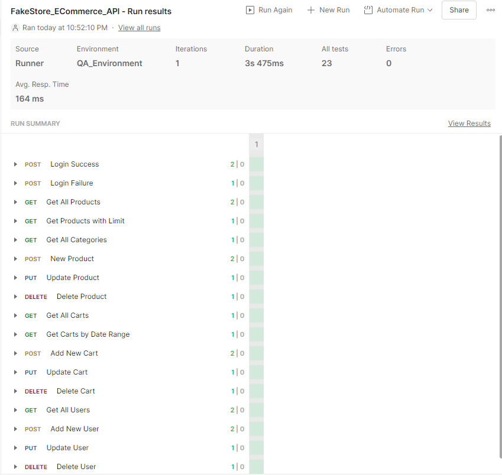

# 🛒 FakeStore API Automation Project

## 📌 Project Overview
This repository contains a complete Automated API Testing framework for the [FakeStore API](https://fakestoreapi.com/).
The project utilizes **Postman** and **JavaScript** to test E-commerce workflows including Authentication, Products, Carts, and Users.

## 🛠 Features & Coverage
- **Tool:** Postman (Collection Runner).
- **Test Count:** 23+ Test Cases.
- **Scenarios:**
  - ✅ **Positive Testing:** Verify standard CRUD operations (Get, Post, Put, Delete).
  - ⚠️ **Negative Testing:** Verify error handling (e.g., Invalid Login).
  - 🔄 **Chaining:** Dynamic data handling (creating a product, capturing its ID, and using it for update/delete).
  - 🔍 **Filtering:** Testing limits, sorting, and date ranges.

## 📂 Files Included
1. **FakeStore_Collection.json:** The main test scripts and requests.
2. **QA_Environment.json:** Environment variables (Base URL, Tokens, etc.).
3. **Test_Execution_Report.png:** Proof of successful execution.

## 📸 Execution Result

## 🚀 How to Run
1. Clone or Download this repository.
2. Open Postman.
3. Import `FakeStore_Collection.json`.
4. Import `QA_Environment.json`.
5. Select `QA_Environment` from the top right corner.
6. Run the collection using **Collection Runner**.
